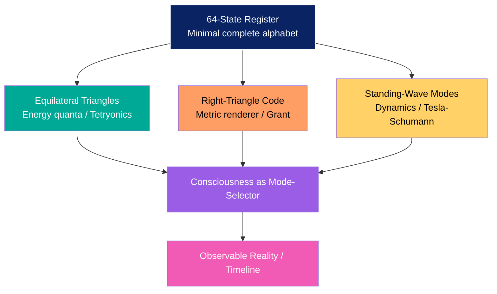

# The 64 Theory 1.01: A Triangle-Coded Register Model for Informational Granularity in Nature

[](https://doi.org/10.5281/zenodo.19038531)
[](https://creativecommons.org/licenses/by/4.0/)
[](https://www.python.org/downloads/)
[](./README.md)

**Published**: March 15, 2026 | **Version**: 1.01 | **DOI**: [10.5281/zenodo.19038531](https://doi.org/10.5281/zenodo.19038531)  
**License**: [CC BY 4.0](./LICENSE) (Content) | [MIT](./LICENSE_CODE.md) (Code)  
**Author**: [Umair Abbas Siddiquie](https://orcid.org/0009-0008-3968-2252) (Tune Talk Academy, NAIEP)

---

## 🗂️ Table of Contents
- [Overview](#-overview)
- [Repository Contents](#-repository-contents)
- [Testing the Hypothesis](#-testing-the-hypothesis)
- [Conceptual Framework](#-conceptual-framework)
- [References](#-selected-references)
- [Contributing](#-contributing--collaboration)
- [Citation](#-contact--citation)

---

## 📄 Overview

Recurrent appearances of the number 64 across biological coding (64 codons), embryonic development (64-cell blastocyst), digital computation (64-bit architectures), and symbolic systems (64 I-Ching hexagrams) suggest a possible informational granularity in nature. 

This repository presents a geometric working model wherein **64-state registers**—tessellations of equilateral Planck-energy triangles (Tetryonics) resolved by universal right-triangle metric codes—serve as minimal units for encoding complete alphabets of states across domains.

### Key Contributions
- **Mathematical formalization**: Scale-Free Lagrangian and Pythagorean Generator mapping atomic structure to galactic morphology (Pearson *r* = −0.936)
- **Dynamical framework**: Standing-wave modes over registers (Tesla/Schumann resonance) for interpreting timeline shifts and subjective anomalies
- **Falsifiable research program**: Statistical analysis of bifurcation angles in natural branching systems to test convergence toward right-triangle angular ratios

> ⚠️ **Note**: This is a provocative, evidence-informed hypothesis—not established physics. It invites interdisciplinary collaboration without claiming to replace the Standard Model or general relativity.

---

## 📁 Repository Contents

| File | Size | Description |
|------|------|-------------|
| `manuscript/The-64_Theory_..._Nature.PDF` | 687.3 kB | Full journal-article manuscript (Zenodo-published) |
| `figures/64-Register_Infographic_Domains.png` | ~5.0 MB | **New**: Cross-domain pattern visualization (Biology, Computing, I-Ching, Chess) |
| `figures/The_64-Register_Equilateral_Energy.png` | 6.5 MB | Integrated schematic of the full 3-layer model |
| `figures/Layer-1_Vacuum_Scaffold_Outer_Ring.png` | 6.3 MB | 64-tetrahedron vacuum register @ Planck scale |
| `figures/Layer-2_Equilateral-Energy_Tessellation.png` | 5.3 MB | Equilateral Planck triangles as energy quanta (Tetryonics) |
| `figures/Layer-3_Right-Triangle_Metric_Overlay.png` | 6.0 MB | Right-triangle code as rendering engine for fractal selection |
| `figures/Central_Node_Conscious_Mode-Selector.png` | 5.4 MB | Diagram: Consciousness as mode-selector over standing-wave configurations || `scripts/branching_angle_analysis.py` | — | Prototype pipeline for angle-extraction hypothesis testing |
| `requirements.txt` | — | Python dependencies for analysis scripts |

*All figures: MD5 checksums available in Zenodo record for integrity verification.*

---

## 🔬 Testing the Hypothesis

### Proposed Research Pipeline (Manuscript Section 10)
```python
# scripts/branching_angle_analysis.py
# Tests whether natural branching systems converge on right-triangle angular ratios

1. Compile high-resolution datasets:
   - Neuronal reconstructions (NeuroMorpho.Org)
   - River networks (HydroSHEDS)
   - Lightning mapping arrays (ENGLN)
   - Vascular imaging (public medical datasets)
   - Galactic spiral arm tracings

2. Extract bifurcation angles via skeletonization + vector analysis

3. Cluster angles (DBSCAN) and compare to right-triangle benchmarks:
   - Pythagorean triples: 3-4-5 (36.87°/53.13°), 5-12-13, etc.
   - Tetrahedral projections: ~35.26°, ~54.74°
   - Golden-ratio triangles: φ-based angles

4. Test scale invariance: micron → kilometer ranges

5. Statistical validation: permutation testing vs. random angular distributions
```

### Quick Start
```bash
# Clone and install dependencies
git clone https://github.com/trizist/triangle-coded-reality.git
cd triangle-coded-reality
pip install -r requirements.txt

# Run prototype analysis (example dataset required)
python scripts/branching_angle_analysis.py --input data/example_branches.csv
```

*See `scripts/README.md` for full CLI options and dataset formatting guidelines.*

---

## 🧭 Conceptual Framework


*If Mermaid rendering is unavailable, see `docs/CONCEPTUAL_FRAMEWORK.md` for an ASCII/text fallback.*

### Core Principles (Manuscript Section 12)*If Mermaid rendering is unavailable, see `docs/CONCEPTUAL_FRAMEWORK.md` for an ASCII/text fallback.*

### Core Principles (Manuscript Section 12)git clone https://github.com/trizist/triangle-coded-reality.git
cd triangle-coded-reality
pip install -r requirements.txt

# Run prototype analysis (example dataset required)
python scripts/branching_angle_analysis.py --input data/example_branches.csv
```

*See `scripts/README.md` for full CLI options and dataset formatting guidelines.*

---

## 🧭 Conceptual Framework


*If Mermaid rendering is unavailable, see `docs/CONCEPTUAL_FRAMEWORK.md` for an ASCII/text fallback.*

### Core Principles
```
64 = register size (minimal complete alphabet for a domain)
   │
   ├─ Equilateral triangles = energy quanta (Tetryonics)
   │    └─ Area ∝ Planck-energy; tessellation → tetrahedral standing waves
   │
   ├─ Right triangles = metric/rendering code (Grant)
   │    └─ a²+b²=c² selects observable fractal; universal schema of ratios
   │
   ├─ Standing waves = dynamical modes (Tesla/Schumann)
   │    └─ Discrete cavity resonances; timeline = selected mode
   │
   └─ Consciousness = mode-selector
        └─ Awareness locks into specific standing-wave configuration
```

---

## 📚 Selected References

| Domain | Source |
|--------|--------|
| **64-pattern recurrence** | Genetic code (64 codons); Embryology (64-cell blastocyst); 64-bit computing; I-Ching hexagrams |
| **Planck-scale geometry** | [Planck units (Wiki)](https://en.wikipedia.org/wiki/Planck_units); [Quantum spacetime review (arXiv:hep-th/0303037)](https://arxiv.org/abs/hep-th/0303037) |
| **64-tetrahedron vacuum** | Haramein, N. *Generalized Holographic Model* (SpaceFed, 2025) |
| **Tetryonics** | Abraham, K. *An Introduction to Tetryonic Theory* (IJSRP, 2014) |
| **Right-triangle fractals** | Grant, R.E. *One is the Only Constant* (2026); *Galaxies as Macro-Elements* (PDF, 2026) |
| **Standing waves** | Schumann resonances (Wiki); Tesla terrestrial resonance reviews |

*Full bibliography with DOI links in `manuscript/The-64_Theory_..._Nature.PDF`.*

---

## 🤝 Contributing & Collaboration

This is a **working model**, not a closed doctrine. Contributions welcome in:

- 📊 **Empirical testing**: branching-angle datasets, statistical validation, scale-invariance analysis
- 🔢 **Formal mathematics**: refining the Scale-Free Lagrangian / Pythagorean Generator, symbolic algebra
- 🎨 **Visualization**: improving diagrams, interactive WebGL/D3 explorables, accessibility enhancements
- 🧠 **Philosophical critique**: epistemological boundaries, consciousness-model interfaces, ethics of timeline frameworks

### Contribution Workflow
```bash
# 1. Fork the repository
# 2. Create a feature branch
git checkout -b feat/your-idea

# 3. Make changes with clear, atomic commits
git commit -m "test: add permutation test for angle clustering"

# 4. Push and open a Pull Request
git push origin feat/your-idea
# → Open PR at https://github.com/trizist/triangle-coded-reality/pulls
```

*All contributions must respect the CC BY 4.0 license, include appropriate attribution, and adhere to academic integrity standards. New data/code should include minimal reproducibility instructions.*

---

## 📬 Contact & Citation

**Author**: Umair Abbas Siddiquie  
**ORCID**: [0009-0008-3968-2252](https://orcid.org/0009-0008-3968-2252)  
**Affiliations**: Universal Artic Solutions; Tune Talk Academy; NAIEP (Pakistan)  
**Email**: umair.siddiquie@gmail.com  
**GitHub**: [@trizist](https://github.com/trizist) | **Zenodo**: [10.5281/zenodo.19038531](https://doi.org/10.5281/zenodo.19038531)

### Cite this work (APA / BibTeX)
```bibtex
@article{siddiquie202664theory,
  title={The 64 Theory 1.01: A Triangle-Coded Register Model for Informational Granularity in Nature},
  author={Siddiquie, Umair},
  year={2026},
  publisher={Zenodo},
  doi={10.5281/zenodo.19038531},
  url={https://github.com/trizist/triangle-coded-reality},
  license={CC-BY-4.0}
}
```

### APA Reference
> Siddiquie, U. (2026). *The 64 Theory 1.01: A Triangle-Coded Register Model for Informational Granularity in Nature*. Zenodo. https://doi.org/10.5281/zenodo.19038531

---

## 🔑 Keywords

`64-register hypothesis` `discrete spacetime` `fractal geometry` `right-triangle code` `equilateral energy` `standing waves` `Pythagorean generator` `Scale-Free Lagrangian` `quantum geometry` `Tokunaga statistics` `branching angle analysis` `timeline shifts` `Mandela effect` `Tetryonics` `Planck scale` `informational granularity` `geometric physics`

---

> *"64 is the register. Equilateral triangles are energy. Right triangles are the code. Standing waves are the modes. Consciousness is the chooser."*  
> — Umair Abbas Siddiquie, March 2026

*This repository is part of the Triangle-Coded Reality research initiative. Explore related work at [github.com/trizist](https://github.com/trizist).*

---

### 📄 Repository Metadata (for automation)
```yaml
# .zenodo.json snippet
{
  "title": "The 64 Theory 1.01: A Triangle-Coded Register Model for Informational Granularity in Nature",
  "creators": [{
    "name": "Siddiquie, Umair",
    "orcid": "0009-0008-3968-2252",
    "affiliation": "Universal Artic Solutions; Tune Talk Academy; NAIEP"
  }],
  "publication_date": "2026-03-15",
  "description": "Geometric hypothesis: 64-state registers of equilateral Planck triangles, resolved by right-triangle codes, as minimal units of informational granularity in nature.",
  "keywords": ["64-register", "discrete spacetime", "fractal geometry", "right-triangle code", "equilateral energy", "standing waves"],
  "license": "cc-by-4.0",
  "upload_type": "software",
  "access_right": "open"
}
```
## 📜 Licensing

| Component | License |
|-----------|---------|
| Manuscript, figures, documentation | [CC BY 4.0](./LICENSE) |
| Python scripts, analysis code | [MIT](./LICENSE_CODE.md) |

*Last updated: March 16, 2026 | Repository version: 1.01 | DOI: 10.5281/zenodo.19038531* 🌀🔺
